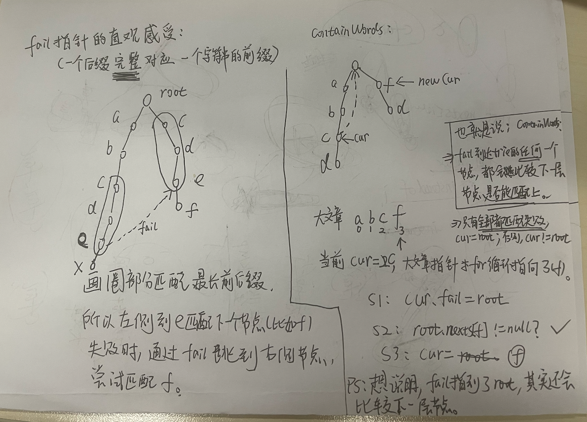

原理补充：
1. 如果匹配过程中，大文章的一个字符 对应 trie的root节点，那么说明：
    - 这个大文章字符 无法参与匹配任何一个敏感词。
    - 所以，该字符对应root节点。进而随着for循环，下一个(loop)大文章字符 会 从头开始匹配trie。
        - 其余情况下，只要能够匹配上，大文章指针当前指向的字符 与 trie指向的节点 一定是一一对应的（即都有字符且字符一定相同） -> 且一定对应trie [1,n]层 (第一层就是 root.nexts[index]!=null的时候) / 如果最终cur停留在root，说明匹配失败。等待大文章下一个位置开始重新匹配
2. AC只是借鉴了KMP的最长前后缀以及失败跳跃逻辑，但是具体细节是不同的，这个一定要记住+理解： 
   1. !一句话总结：AC fail指针是【包含】当前节点的最长前后缀，KMP是【不包含】当前节点的最长前后缀
   2. AC fail指针是 包含当前cur的字符串，去寻找最长匹配后缀 前缀字符串
   3. KMP nexts数组，nexts[i]看的是 [1, i -1]上的最长前后缀长度

1. 主要还是看 [Code04_AC2.java](Code04_AC2.java)
   - 简洁 + 标出了模板部分+修改部分（很小一块，containWords：Node follow转圈的时候收集的信息需要适配题目）。
