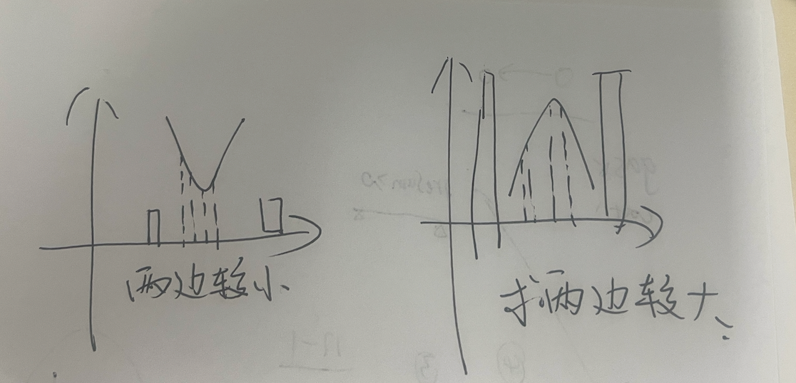
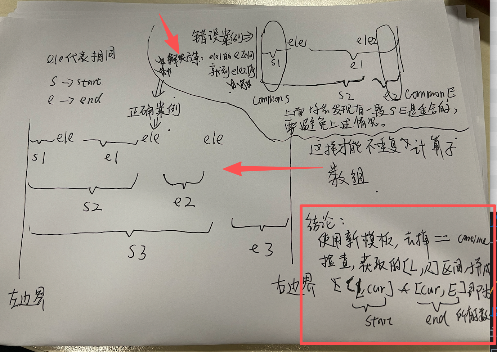

## 超重点 - 核心单调栈能够 （求每个子数组的最小值/最大值） 【以每个元素 为最小值的 子数组情况！！！！！！】但是要分析清楚，比如 LC 907就是 允许重复值模板下，保留==情况的，即，也要加入计算。 =》 但是对于 柱状图/二维矩阵的，都要排除==情况，避免重复计算
0. 先说一点：LC907_SumOfSubarrayMinimums： 通过1（<=所有情况都算，因为考虑到每一个元素为最小值时）+ 2（子数组起点区间）*(子数组终点区间) 即可包含 所有的子数组情况。无需复杂或者很细节的代码逻辑
1. 本质：对于每个元素作为最小值，包含了哪些数组？ 假设区间L,R。每个元素包含的数组为 [L, cur]作为start， [cur, R]作为end => start数量 * end数量
2. 【超重要】单调栈也是针对【子数组】问题 =》涉及每个子数组的最大/最小 相关问题（避免每个子数组遍历获取（N^3））。 见下方2的进一步解释、
  - 走完一遍单调栈 =》 得到1）每个子数组的 最大值/最小值
2. 【重要】O(N)求出所有子数组的 峰谷（即最小值)(对应求两边较小） 或 峰顶（即最大值）（对应求两边较大）。  （ps: 画个图就知道了）
  - 
3. 续2：每个最大最小值对应哪些子数组？Answer: 左侧为start区域[l,cur]  右侧为end区域[cur,R] （都包含cur是因为start<=end都有数），此时每个start对应每个end，都能得到一个包含cur（子数组最大值/最小值）的子数组。 所以子数组数量为=> 【左区间个数 * 右区间个数】
4. 细节处理：基本所有题，都是用Stack<Integer> 模板单调栈。 
   - 处理存在相同元素的情况，一般会忽略前N-1个相同元素，只取最后一个相同元素。（你可以理解为L都是相同的，只是R不同，但是只有最后一个元素代表着[L,R]区间的最值是cur）
   - 代码怎么写？当元素相同时弹出，但是不做任何处理 =》 只有 ele<栈顶元素时，处理。   =》 好好理解一下
   - 其实就是说我要一个区间最小值cur，单调栈下相同元素弹出不管，只看最后一个相同元素的弹出（也就是被较小值弹出的情况），【此时的区间就是 该cur值作为最小值的 最大子数组区间】
5. 新模板的不重复子数组怎么看/有哪些 ？
   - 主要难点：在一个区间内 有多个重复元素的情况
   - 

### 单调栈： 特别擅长解决 【子数组数量】 最大值，最小值 相关问题！！！ 子数组利器！！
#### 从栈中 弹出的元素 为 要处理的元素！！！！
#### 子数组数量，注意 左侧数目*右侧数目 = 以i元素为中心点的子数组数量！！！ （换句话说，就是包含 i 号元素的子数组数量） =》 20260315的解释：左侧为start区域[l,cur]  右侧为end区域[cur,R] （都包含cur是因为允许 start==end），此时每个start对应每个end，都能得到一个包含cur的子数组。 所以子数组数量为=> 左区间个数 * 右区间个数
- [单调栈 - 包含重复元素和非重复元素的实现](monotonousStack/MonotonousStack.java):
- [区间子数组的个数](monotonousStack/NumSubarrayBoundedMax.java)：**！！！ 这道题属于 单调栈类 中 【不同下标上的相同值，都需要计算， *包含* 该元素的子数组数量（左侧*右侧）】。对于相同值的处理问题， 使用 == 情况一并弹出，并计算，从而不重合且不漏。** 总结的话， 包含多个重复元素的时候（区间），这个共同区间 每次都给这一组中的最后那个元素分配，这样才不会算少或算多。（私有部分 + 分配的公共部分 == 我们的解法）
    - https://leetcode-cn.com/problems/number-of-subarrays-with-bounded-maximum/
    - 找出子数组中 最大元素在范围 [left, right] 内的子数组，并返回满足条件的子数组的个数。
    - 【错误题，需重做】 很多错误的小点
    - 特别注意 关于以当前数字为max的区间 关于有重复值的问题 的 重合区间问题！！！ 在该问题中， 是相等时正常pop，并且计算其对应的范围。 最终可以实现，相等值的区间全覆盖并且不重合。
    - 使用 系统提供的栈实现 + 手写数组栈实现
- [子数组的最小值之和](monotonousStack/SumSubarrayMins.java):
    - https://leetcode-cn.com/problems/sum-of-subarray-minimums/
    - 思路本来很简单的： 【1】单调栈，最小值 【2】计算每个元素都要包含在对应子数组的情况，求子数组对应数量，左侧*右侧 类型题
    - 【错误点，一定要重做，并且关注错误点】 数值越界问题！！！卡了一个小时。记得回去看错误的提交记录，很细节的数值越界问题，要考虑到题目给的限制条件以及数值相乘之后的大小是否越界，并且越界的话如何避免。
    - 记录错误的题解: https://leetcode-cn.com/problems/sum-of-subarray-minimums/solution/zhong-yao-dan-diao-zhan-zi-shu-zu-min-yi-l787/
- [子数组最小乘积的最大值](monotonousStack/MaxSumMinProduct.java):
    - https://leetcode-cn.com/problems/maximum-subarray-min-product/
    - 一个数组的 **最小乘积** 定义为这个数组中 【最小值】 乘以 【数组的 和】 。
    - 解法： 单调栈 + 前缀和
    - 单调栈问题 多多会涉及 % 10^9 + 7, 所以在设计变量类型的时候，要多多考虑使用long类型
    - 【错误点】虽然这次注意到了 ans要使用 Long类型来存储，但是前缀和数组的类型没有注意到。 前缀和数组 使用 long类型 ==》 10^5 * 10^7 > 10^9； 所以最大和会超过 32位有符号 但是 小于64位有符号。
- [柱状图中最大的矩形](monotonousStack/LargestRectangleArea.java):
    - https://leetcode-cn.com/problems/largest-rectangle-in-histogram/
    - 子数组 最小值问题， 目标为 求 最大Area，所以是 【单调栈的比较类型题目】， *==情况下弹出正常算*，真正对的值会在最后一个相等时算出，覆盖不完全算对的值，从而最终依然可以获得正确答案。

- [二维数组的最大矩形](monotonousStack/LargestRectangle.java):
    - https://leetcode-cn.com/problems/largest-rectangle-in-histogram/
    - 压缩数组 + 单调栈（最值问题）
    - 具体而言就是 每一行的压缩数组 + 柱状图的最大矩形问题

- [二维数组中统计全1的矩阵数量](monotonousStack/NumSubmatrics.java):
    - https://leetcode-cn.com/problems/count-submatrices-with-all-ones/
    - 以每一行为地基 ==》 以每一行为矩阵的开始节点（也就是说 在遍历每一行的时候计算矩阵数量时，对应的矩阵必须包含该行）
    - 几个小点：
        - 1. 比较特殊的， == 时弹出，但是不做任何处理。 也就是说，只取相等的最右侧的下标进行 矩阵数量的运算。（**因为 本题 不需要包含当前位置i，所以与求数组数量类型问题的方法不同**）
        - 对于每一行得到的压缩数组而言， 对于任一弹出的i节点，假设左右较小位置为l, r 矩阵数量求法： (heights[i] - Math.max(heights[l], heights[r])) * ((N + 1) * N / 2); 。 单调栈弹出过程全部做相同计算， 加和sum。
        - ==》 最小高度差 * 【作为最小值的范围 -> 矩形】内任意同一高度下的子矩阵数量（不需要包含当前位置i）
    - 【错误点】(1) 选取两侧较小值中的最大值时，要注意两侧无较小值的情况，要分类讨论！ （2）在取最大值时，忽略了栈中只是存的下标，拿出来比较两侧较小值中的较大值时，是要配上数组nums进行比较的，也就是说 两侧较小取得为 i,j 但是比较时，要使用 Math.max(nums[i], nums[j]);
