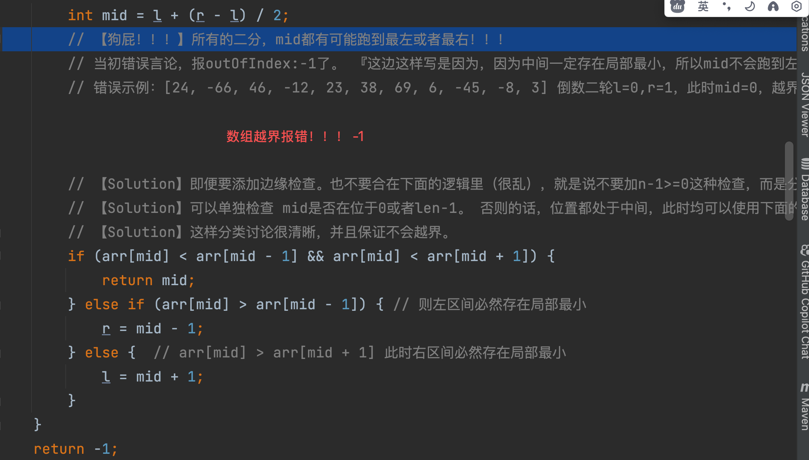
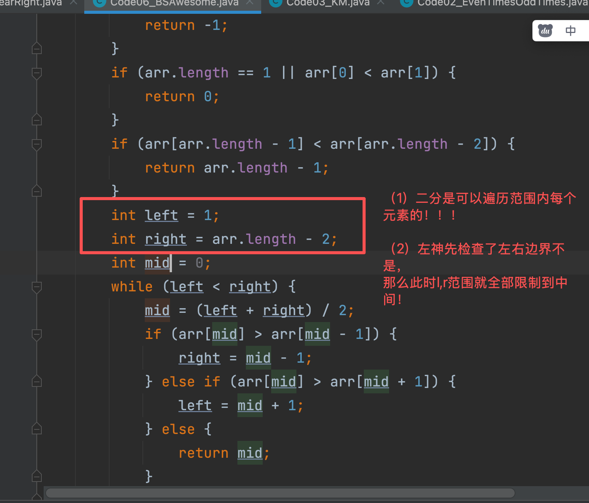

## 重要总结
1. 二分法中，l,r范围内，mid是有可能取[l,r]范围内任何一个index的！！！！   [0,2,3,4,6] -> mid先取2然后留左区间 -> 变成[0,2] 此时mid=0 是存在的
2. BSAwesome特别具有代表性，由于1存在的风险，所以如果[l,r]二分，while很难写，因为你要检查左右两个index的值，但是mid可能取到边界值。
  a. 所以特别重要的，[l,r]区间的选择核心思想：[l,r]内的元素必须可能是最终答案。 所以BSAwesome，因为一开始检查了左右边界，所以后续的二分法区间直接选择[1, arr.length - 2]
3. 二分法是有框架的，别慌
```java
int l = 0;
int r = arr.length - 1;

//while (l >= r) {     // TODO: 【错误点】千万别写反了，排序base case那是base结束递归条件。  你这个是保证区间内进行二分，while(l<=r)
while (l <= r) {
        int mid = (l + r) / 2;
    // xxxxxxx
}
```

## 大纲
1. 二分法查找一个数字是否存在 =》 前提：排序数组
2. BS查找 <= 一个数字的最右 =》 前提：排序数组，这种求最左最右的 一定要二分到底
3. BS查找 >= 一个数字的最左 =》 前提：排序数组，这种求最左最右的 一定要二分到底
4. 不排序的情况：给定一个数组，任一相邻的元素不相等，局部最小问题


## 错题本
1. [无序数组，数字各不相同，求局部最小](BSAwesome.java)：
- while循环，没有考虑清楚mid会跑到边界的情况，导致数组越界。
- 所有的二分，mid都有可能跑到最左或者最右！！！
- 
- 【重要，左神，好解法】二分法会遍历l,r范围内的所有元素。因为先检查了左右边界不是，那么此时l,r范围可以收缩到1,len-2。 因为只剩中间元素需要检查了，就可以统一使用一套if检查逻辑
  - 
