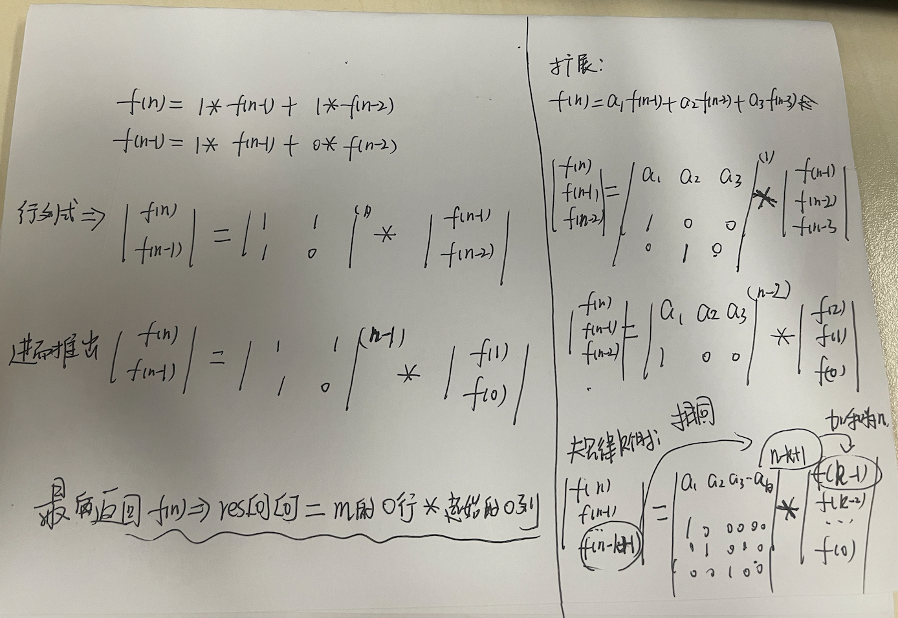

# 最新重点：
1. fib:
```
套路点：
1. n >= 45时，必然发生整数溢出。  int范围2*10^9, 而题目要求取模1e9+7，那么矩阵相乘过程中 a*b 必然超过10^9
2. 因此 一阶递推类题目，但凡涉及取模1e9+7，TODO:  **矩阵全部设置为 long[][]**
3. TODO：续2，i行j列计算res[i][j]时， 每次 x = a[i][k]*b[k][j]%1e9 取模，然后 ans+=x后还要取模，让每次计算前的数字都在摸范围内，那么最大的计算值就是 1e9 * 1e9 不会超过long。
4. TODO：所以对于3的套路很清晰，就改 multiMatrix两行代码就可以，加上取模。 因为本质上是在每次涉及到增量计算的地方都立即取模。

错误点：
1. 一阶递推题目，必须要加base case！！！  不然斐波那契f(0)=0，但是走函数会返回m[0][0]=1！
2. int[][] a 或者 long[][] b。 所有的数组类型[]里面都必须是int类型。
3. long不能自动转int。 属于lossy conversion，需要手动转。
```
2. numWaysOfFrog
```
/**
     与 fibonacii唯二的区别：
     1. n==0是 本题为1。  而fib(0)=0
     2. 但是递推式相同，因为m相同
     3. 因为 f(0)=1，因此最终返回f(n)时， 要计算矩阵的 m[0][0] + m[0][1] ，特别**注意先取模，再转int**
     **/
```


# 重点
0. 【超重点】适用于任何一阶递推式！！！！
1. 斐波那契原始数列: f(n) = f(n-1) + f(n-2)
2. 由递推式->矩阵快速幂 

图片错误补充，再决定matrix的pow是多少时？ 只取决于右侧的最高是多少，比如有测试 f(2),f(1)，那么此时pow=n-2 （凑起来为n）
更正的是什么？ 不看左侧最后一个元素，不管那个东西！！！继续上面例子，左侧最下是f（n-1），与pow的取值完全无关！！！
3. [[FibonaciiProblem.java](FibonaciiProblem.java)]最大的坑就是，int溢出，取模！！！ 所以一旦n>45/题目说到取模：
   - 1. 在int溢出，取模题目中的绝对结论（在这上面踩了太多坑了！！！）：
   - 2. 涉及到int溢出的计算（题目明确说了取模/n>459），就全部使用long类型，不要妄图使用int类型了。
   - 3. 对于斐波那契数列n==100，此时中间结果就会到达10^21，大于Long。 所以尽可能在每次计算时也取模，不要光结尾取模！！！不用管冗余代码问题，先一次性做对！！！

# 错误点
1. 跳跃游戏：1）需要二维数组全部换成Long类型 2) n=100时，long类型也装不下去，所以需要每次计算完matrixPow后，都%。 不能仅仅在最终结果&
2. 人家ai都说了：
   1. 注意事项
      - 大数取模：由于斐波那契数列增长极快，题目要求对结果取模 1000000007。注意在循环中每一步都要取模，防止中间结果溢出。
      - 边界条件：注意 n=0和 n=1的特殊情况。
      - 时间复杂度：循环解法为 O(n)，在题目给定的 n <= 100范围内完全可行。


## 矩阵快速幂: 所有【严格递推式】都可以转变为【行列式】。 并且使用矩阵快速幂技巧可以将时间优化到 O（logN）；
- [公式： 矩阵的快速幂](src/main/java/matrixFastPow/MatrixPow.java)： 包括两个函数：二进制幂 O(Log N) 以及 细分的 矩阵相乘函数；
- [斐波那契数列](src/main/java/matrixFastPow/FibonaciiProblem.java):
    - https://leetcode-cn.com/problems/fei-bo-na-qi-shu-lie-lcof/
- [青蛙跳台阶问题/跳跃游戏](src/main/java/matrixFastPow/NumWaysOfFrog.java):
    - https://leetcode-cn.com/problems/qing-wa-tiao-tai-jie-wen-ti-lcof/
- [爬楼梯]： 斐波那契，但是起点从f(1)开始
## 什么是斐波那契数列

### 有两种表达：
1. 一种是从0下标开始：F(0)=0, F(1)=1, F(2)=1
2. 第二种是从1下标开始：F(1)=1, F(2)=1, F(3)=2
3. 【注意】实际值相同：无论是哪种定义，数列的实际数值序列是相同的（定义1只是多了个0）


斐波那契数列（Fibonacci sequence）是**计算机算法和数学中的一个经典数列**，定义非常简单但应用非常丰富。

## 1. 数列定义
数列从 0 和 1 开始，后面的每一项都是前两项的和：

```
F(0) = 0
F(1) = 1
F(n) = F(n-1) + F(n-2)  (n ≥ 2)
```

**前几项**：
```
0, 1, 1, 2, 3, 5, 8, 13, 21, 34, 55, 89, 144, ...
```

## 2. 在算法中的意义

### 算法教学中的"Hello World"
斐波那契数列是算法入门的经典案例，可以**对比不同算法的时间复杂度**：

```java
// 1. 递归实现（时间复杂度 O(2^n)）
int fib1(int n) {
    if (n <= 1) return n;
    return fib1(n-1) + fib1(n-2);
}

// 2. 动态规划（时间复杂度 O(n)）
int fib2(int n) {
    if (n <= 1) return n;
    int[] dp = new int[n+1];
    dp[0] = 0; dp[1] = 1;
    for (int i = 2; i <= n; i++) {
        dp[i] = dp[i-1] + dp[i-2];
    }
    return dp[n];
}

// 3. 矩阵快速幂（时间复杂度 O(log n)）
int fib3(int n) {
    if (n <= 1) return n;
    int[][] base = {{1, 1}, {1, 0}};
    int[][] result = matrixPower(base, n-1);
    return result[0][0];
}
```

### 大O表示法的直观展示
同一个问题，三种不同算法的时间复杂度对比：

| 实现方式 | 时间复杂度 | 空间复杂度 | 适用场景 |
|---------|-----------|-----------|---------|
| 朴素递归 | O(2ⁿ) | O(n) | 仅用于教学演示（性能极差） |
| 记忆化递归 | O(n) | O(n) | 递归思维训练 |
| 动态规划 | O(n) | O(1) 可优化 | 实际应用 |
| 矩阵快速幂 | O(log n) | O(1) | 大规模n值 |

## 3. 在面试中的常见考察点

### 基础题
```java
// 面试题1：手写斐波那契
int fibonacci(int n) {
    if (n < 0) throw new IllegalArgumentException();
    if (n <= 1) return n;
    
    int prev1 = 0, prev2 = 1;
    for (int i = 2; i <= n; i++) {
        int curr = prev1 + prev2;
        prev1 = prev2;
        prev2 = curr;
    }
    return prev2;
}
```

### 进阶题
1. **爬楼梯问题**（LeetCode 70）
  - 每次可以爬1或2个台阶
  - 爬到第n阶有多少种方法？
  - 答案：f(n) = f(n-1) + f(n-2)

2. **青蛙跳台阶**（剑指Offer 10）
  - 每次可以跳1~n级
  - 数学归纳：f(n) = 2^(n-1)

3. **矩形覆盖**（剑指Offer 10）
  - 用2×1的矩形覆盖2×n的矩形
  - 多少种覆盖方法？

## 4. 实际应用场景

### 计算机科学
- **算法设计**：分治策略、动态规划教学
- **性能测试**：测试递归深度和函数调用开销
- **黄金分割**：相邻两项比值趋近于黄金比例φ≈1.618

### 软件开发
```java
// 应用1：负载均衡算法
// 斐波那契哈希在某些哈希函数中用于减少冲突

// 应用2：并发控制
// 斐波那契堆（Fibonacci Heap）是一种优先队列数据结构
// 支持O(1)摊还时间的插入和O(log n)的删除最小元素
```

### 金融和交易
- 斐波那契回调线：技术分析工具
- 用于预测股价支撑位和阻力位

## 5. 需要注意的问题

### 整数溢出
当n较大时，斐波那契数会非常大，需要处理溢出：

```java
// 方法1：使用BigInteger
import java.math.BigInteger;

BigInteger fibonacciBig(int n) {
    BigInteger a = BigInteger.ZERO;
    BigInteger b = BigInteger.ONE;
    for (int i = 2; i <= n; i++) {
        BigInteger temp = a.add(b);
        a = b;
        b = temp;
    }
    return b;
}

// 方法2：取模运算（常见于编程竞赛）
int fibonacciMod(int n, int mod) {
    if (n <= 1) return n % mod;
    int a = 0, b = 1;
    for (int i = 2; i <= n; i++) {
        int temp = (a + b) % mod;
        a = b;
        b = temp;
    }
    return b;
}
```

### 性能陷阱
```java
// 错误示例：指数级递归
int badFibonacci(int n) {
    if (n <= 1) return n;
    return badFibonacci(n-1) + badFibonacci(n-2);
}
// 时间复杂度：O(2^n)，n=50就需要约2^50次计算
```
## 总结
斐波那契数列在算法中不仅是简单的数学问题，而是：
- **算法复杂度教学**的典型案例
- **多种算法思想**的实现平台
- **面试高频考点**的载体
- **性能优化思维**的训练场

掌握斐波那契数列的不同解法，是算法学习的重要里程碑。


## 重点
1. 代码分为两部分：
   (1) 矩阵乘法函数 + 矩阵pow函数（求矩阵的n次方）
   (2) fabonacii技巧