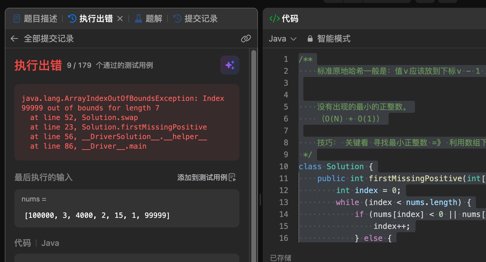
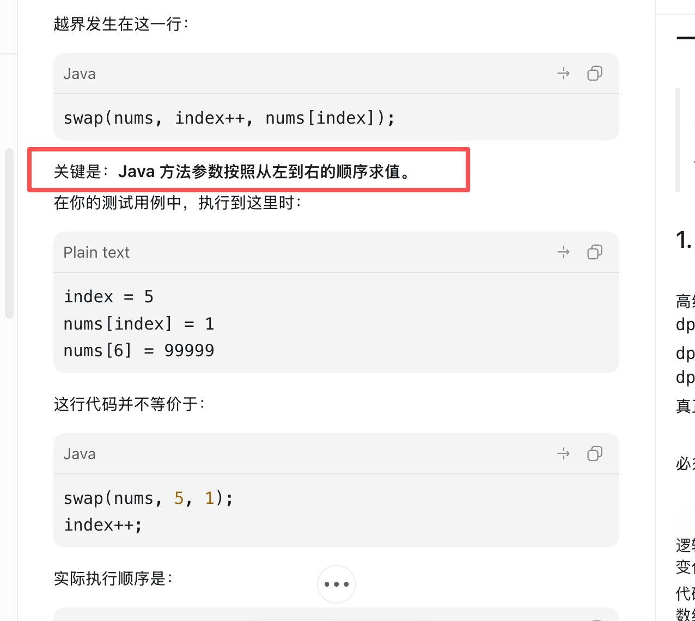
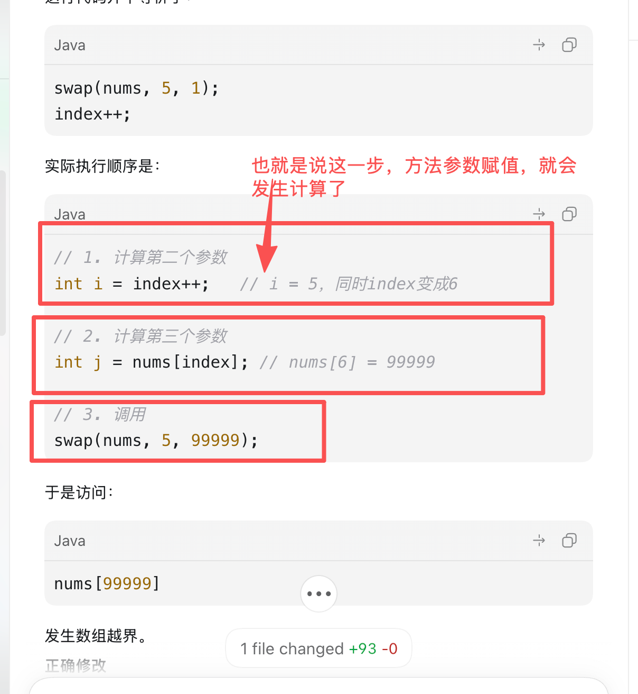

# Q41：方法实参求值顺序导致数组越界

## 索引

1. [结论](#结论)
2. [实参求值与形参初始化](#实参求值与形参初始化)
3. [错误截图与失败用例](#错误截图与失败用例)
4. [参数求值顺序图解](#参数求值顺序图解)
5. [错误语句](#错误语句)
6. [Java 实际求值过程](#java-实际求值过程)
7. [为什么即使不越界也不应该-index](#为什么即使不越界也不应该-index)
8. [最小修正](#最小修正)
9. [推荐的标准原地哈希](#推荐的标准原地哈希)
10. [记忆规则](#记忆规则)

## 结论

对下面这句代码：

```java
swap(nums, index++, nums[index]);
```

理解是完全正确的：

> Java 按从左到右的顺序计算方法实参。计算到 `index++` 时，该表达式把旧值作为第二个实参，但 `index` 本身已经立即加一。随后计算 `nums[index]` 时，使用的是已经加一后的 `index`。

这不是算法的随机边界问题，而是对 **Java 方法实参求值顺序和后缀自增副作用** 理解不完整造成的确定性错误。

## 实参求值与形参初始化

必须把一次方法调用拆成两个阶段理解。

### 阶段一：实参表达式求值

Java 从左到右计算每一个实参表达式：

```java
swap(nums, index++, nums[index]);
```

求值顺序是：

```text
1. 求值nums
2. 求值index++：产生旧值5，同时index立即变成6
3. 求值nums[index]：此时读取nums[6]，得到99999
```

实参表达式中如果包含自增、自减、赋值表达式或方法调用，这些副作用会在该表达式求值时立即发生，
不会等到被调用方法执行完成后再发生。

### 阶段二：形参初始化并进入方法体

实参值准备完成后，可以近似理解为使用这些值初始化对应形参：

```java
// 仅用于帮助理解形参绑定，不是调用方真实生成的Java局部代码。
int i = 5;
int j = 99999;
swap方法体开始执行;
```

因此，“方法调用会把实参计算结果交给形参”这个理解基本正确，但要补充关键前提：

> 先对实参表达式求值并完成其中的全部副作用，再使用求值结果初始化形参。

`index` 从5变成6发生在第一阶段求值 `index++` 时，并不是第二阶段给形参 `i` 赋值导致的。

Java 始终按值传递。基本类型传递数值副本；数组和对象传递引用值的副本。这里的形参 `nums`
拿到的是同一个数组对象的引用值副本，所以 `swap` 方法体能够修改原数组元素。

## 错误截图与失败用例



```text
nums = [100000, 3, 4000, 2, 15, 1, 99999]

java.lang.ArrayIndexOutOfBoundsException:
Index 99999 out of bounds for length 7
```

## 参数求值顺序图解

第一张图强调核心语言规则：Java 方法实参按照从左到右的顺序求值。



第二张图标出了自增副作用真正发生的时机：在第二个实参求值时，
`index++` 就已经将 `index` 从 5 修改为 6，不会等到 `swap` 方法执行完成后再自增。



## 错误语句

```java
swap(nums, index++, nums[index]);
```

这行同时做了两类事情：

1. 为 `swap` 准备下标实参。
2. 修改后续实参仍然需要读取的 `index`。

将状态修改隐藏在方法实参里，不仅可读性差，还会让后续实参看到修改后的状态。

## Java 实际求值过程

错误现场中：

```text
index = 5
nums[5] = 1
nums[6] = 99999
```

Java 可以按下面的等价步骤理解：

```java
int i = index++;       // i = 5，然后index立即变成6
int j = nums[index];   // 读取nums[6]，得到99999
swap(nums, i, j);      // swap(nums, 5, 99999)
```

`swap` 内部随后执行：

```java
nums[j] = tmp;
```

即访问 `nums[99999]`，而数组长度只有 7，因此必然越界。

## 为什么即使不越界也不应该 index++

原地哈希的不变量是：

> 只有当当前 `index` 上的数已经合法归位、无效，或遇到重复值时，才能执行 `index++`。

交换后，原目标位置的值被换到当前 `index`：

```text
交换前：nums[index] = 待归位值
交换后：nums[index] = 从目标位置换回的新值
```

这个新值尚未检查，所以交换后必须留在原 `index`，由 `while` 继续处理。即使将求值顺序的越界问题修补，交换后无条件 `index++` 仍会跳过未处理值。

## 最小修正

不要在方法实参中修改 `index`：

```java
int targetIndex = nums[index];
swap(nums, index, targetIndex);
```

原来的分支：

```java
if (nums[index] > index) {
    swap(nums, index, nums[index]);
} else {
    swap(nums, index++, nums[index]);
}
```

应当整体改为：

```java
int targetIndex = nums[index];
swap(nums, index, targetIndex);
```

`nums[index] > index` 不能决定交换后是否可以移动 `index`。真正的决定依据是：交换后换回来的值是否已经完成检查。在该算法中，答案是“没有”。

## 推荐的标准原地哈希

原实现采用了特殊映射：

```text
值v -> 下标v
值n -> 特殊利用下标0判断
```

该方案可以修正，但需要对 `nums[0]` 做额外解释。面试时更推荐标准映射：

```text
值v -> 下标v - 1
```

```java
public int firstMissingPositive(int[] nums) {
    int index = 0;

    while (index < nums.length) {
        int value = nums[index];
        if (value >= 1
                && value <= nums.length
                && nums[value - 1] != value) {
            swap(nums, index, value - 1);
        } else {
            index++;
        }
    }

    for (int i = 0; i < nums.length; i++) {
        if (nums[i] != i + 1) {
            return i + 1;
        }
    }
    return nums.length + 1;
}
```

标准映射的优势是整理完成后不变量直接为：

```java
nums[i] == i + 1
```

不需要对下标0和数字n做特殊编码。

## 记忆规则

### Java 语言层

> 不要在同一个方法调用中，一边修改变量，一边在后续实参中继续使用该变量。

同时记住：

> 实参表达式先从左到右求值，副作用立即生效；求值结果随后按位置初始化形参。

错误风格：

```java
method(index++, array[index]);
```

推荐风格：

```java
int currentIndex = index;
int targetIndex = array[currentIndex];
method(currentIndex, targetIndex);
// 根据算法不变量，在独立语句中决定是否修改index。
```

### 算法层

> 原地哈希中，交换表示“当前值完成归位”，不表示“当前下标已处理完成”。交换后换回来的新值必须继续检查。
