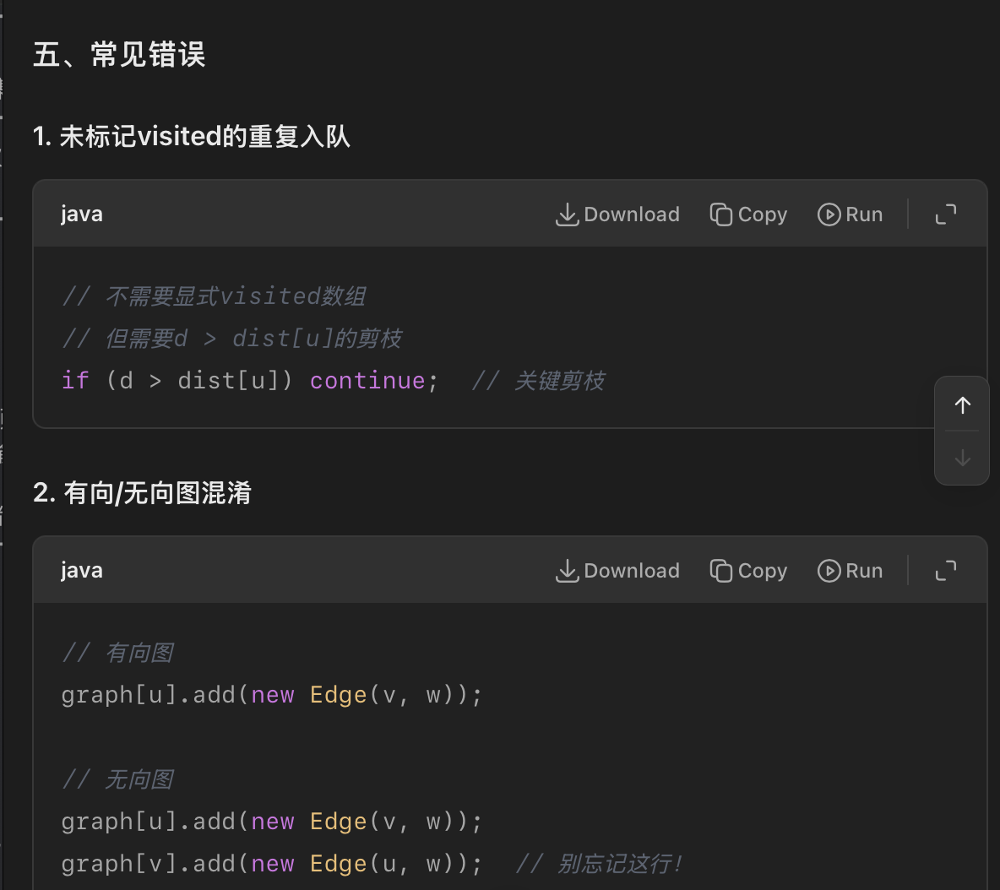
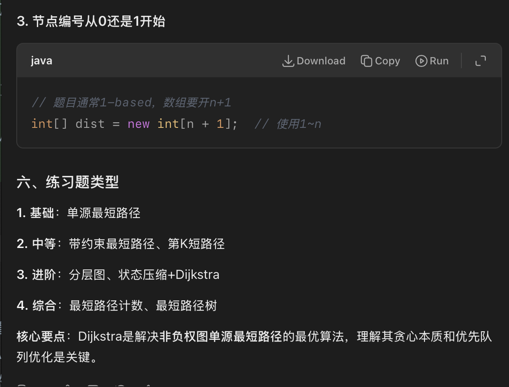

## 记忆点
1. 图的dfs bfs都有HashSet，防止成环！！！
2. 为什么queue bfs是弹出时遍历：因为一个节点只会弹出一次
3.【代码细节多一些】为什么stack dfs是加入时遍历：因为一个节点在stack会反复弹出多次，弹出的目的是dfs另一个孩子分支
   1. 因此代码细节多一些，首先是 遍历有效孩子时再压栈，不是弹出时遍历
   2. 每次成功遍历后，先压父，再压子 （相当于保存当前dfs路径）
   3. 成功遍历->压栈后，要break；这样才能进入下一轮while 弹出最下面的节点，进一步探索dfs。   没有break，就横向遍历一级孩子了，不是dfs了。
4. 拓扑序：
   1. BFS
   ```markdown
      0. 核心围绕知识点：入度；入参为 点集graph；输出为List拓扑序
   实现步骤：
      1. 构建inMap：
          a. 一定要先初始化所有的点 inMap(node, 0)
          b. 再基于node.nexts 给 next节点的入度+1
          c. 目的：这样我们就能够筛选出入度为0的节点
      2. 构建BFS Queue。将入度为0的节点加入queue
      3. 开始BFS:
         a. 每次弹出的节点为当前拓扑序，加入list-ans
         b. 将该节点的nexts 入度全部-1；
         c. 检查是否next 入度变为0
         d. 如果变为0，则满足拓扑序，加入queue
      4. 完成BFS时，则ans存储的就是拓扑序。
      5. 注意：如果有环，则ans.size < graph.size。 说明该图不是一个完整的拓扑结构
    ```
   2. DFS
   ```markdown
      1. 核心为入度，构建 inMap: 注意一定要分两个阶段：先依据graph初始化全部为0，然后依据next增加入度
      2. 根据入度为0的节点构建 List-initialList
      3. 开始DFS-本质是回溯.  dfs(node, inMap, ans) ， for(next)时，对next入度-1，检查是否next.in==0，若为0，则dfs下去；否则for循环下一个
   ```
5. 特别重要！！！无向边集 转化为 邻接矩阵/邻接表，注意 m[i][j]和m[j][i] 都要赋值！！！


## 错误点
1. 特别重要!!! 【无向边集】 转化为 邻接矩阵/邻接表，注意 m[i][j]和m[j][i] 都要赋值！！！   (因为邻接矩阵和邻接表 本来代表的就是 有向边) =》 **无向边本质就是双向边**
a. 对于记忆Prim和Dijkstra时。 考虑 1）【比较大小容器】 2) 【存储解锁节点的容器】 这样就好记住了
    - Prim: 额外多一个mst/minSum变量，记录最小生成树的和
        - 朴素(邻接矩阵)：int[] distances, boolean[] visited
        - 堆优化(邻接表): heap, boolean[] visited/HashSet<> （相比于特斯拉，因为只需要求minSum，所以只需要记录节点，相当于HashSet）
    - Dijkstra
        - 朴素(邻接矩阵): int[] distances, int[] visited
        - 堆优化(邻接表): heap, hashMap<节点，距离>
    - 若输入是 边列表&节点总数n。  依据稠密图/稀疏图判断，将 int[][3] edges转化为 邻接表/邻接矩阵。
        - 要观察 边列表的边定义：1)如果是有向，则转换时只需添加一条（与edge一致的方向）  2) 如果是无向，则转换时需要添加两条(a指向b && b指向a)
        - 结合题意 与 MST还是最小路径，见下面b.c.
b. MST，最小生成树（Minimum Spanning Tree, MST）一定是针对【无向连通图】定义的。
c. no negative-Dijkstra算法【不一定只适用于有向图】，它同样适用于【无负权边的无向图】。
0. 往往下标是[1,n] 所以数组长度要为n+1
1. kruskal 牛客网答案出现多处错误：
   1. 最重要的是 UnionFind union方法还给写错了！！！ 一定要明白，是祖先合并，祖先size相加！！！
2. 最合适的搭配，不然就转化：
   1. 邻接矩阵（稠密） -> 朴素Prim  int[] distance + boolean[] visited
   2. 纯边集合 int[][3] edges  (from, to ,weight) -> kruskal 并查集+排序
   3. 邻接表（稀疏） -> Prim堆优化
   4. DijKstra的话， 1）邻接表->直接用，2）纯边集合->转化为邻接表->堆(NodeRecord) + HashSet selectedNodes
3. 因为都涉及到优先队列/堆 （并查集K算法 可以选择堆/排序 一样），一定要注意：因为给堆传的都是自定义对象/数组int[]，**必须在参数里面 传递比较器!!!!!!** 不然很蠢报错-无法比较元素
4. 【特别注意】无向图，Prim，边列表转换为邻接表时，同一个边 必须在邻接表里面添加【双向边】，不然会报错！！！！
    - 对应 邻接表 （【错误】特别注意，无向图 即 需要每条边 都双向添加到邻接表里面，不然会错误）
    - **所以，无向图在邻接表实现时，通常用双向边来表示**
    - **Prim和Dijkstra代码基本是一模一样的**。
      - 1） 只不过prim只求最后的minSum，所以boolean[] visited记录节点访问过没就够了；而dijkstra使用的是HashMap记录源节点到该节点的最小路径距离
      - 2） 区别就是 扩边后 往heap里面放那一下：prim直接放（toNode, edge），dijkstra 要 (toNode, toNodeMinDistance + nextEdge.weight) 往里放
5. 但是注意，80%以上都是给的边列表。 再将边列表转换为 邻接表时， 要特别注意题意，看一下，到底
    - 1）edge对应 单向边  （明确表达 edge代表 from,to,weight 有向性）
    - 还是 2）edge代表 无相变 （题意，村庄a b，距离为c. 此时即为无向边，邻接表表示时，需要转化为双向边。即一个edge，在graphList 添加graph[from]和graph[to]都要添加）
6. 其余补充点
```text
1. Prim 和 Kruskal 都会遍历所有的边。所以会存在 某个点已经解锁过了，但是又出现了第二边也解锁这个点。！！所以，P和K都要在进行去重检查！！
- Prim使用 boolean[] visited
- K使用 并查集.isSameSet()

2. Dijkstra算法 依赖于 Prim逻辑。 所以擅长邻接表。

3. 边集转邻接表很简单。

4. Prim和K算法 都是针对边进行处理，怎么表示边，堆/排序 泛型就定义为什么。 以P算法举例，邻接表使用int[2] 代表(to, weight)。 这就是representation of edge。所以PriorityQueue<int[]> 就这么设置的。每次弹出边，然后处理。

5. P和K剩下的逻辑 其实很简单。就是出来了边，无脑加入堆就可以了。 然后弹出，检查一下是否取边。 yes则 选边->选点->解锁新邻近边

6. Prim 堆优化 vs. 朴素。使用场景：
    - 堆优化的时间复杂度 可以理解就是为 O(E * logE)
    - 当E<<V^2，堆优化 ， 对应稀疏图 -> 对应 邻接表 （【错误】特别注意，无向图 即 需要每条边 都双向添加到邻接表里面，不然会错误）
    - 对于邻接矩阵int[][] 对应稠密图, E~=N^2，此时 朴素Prim O(V^2) 而 堆优化带入ElogE，则变为了 O(V^2*logV)，此时朴素版 时间复杂度 优于 堆优化。


PS： 为什么是V -> vertex ，中文释义： 顶点

7. Dijkstra算法适用于无负权边的有向图或无向图（即双向边）。


```
8. 

## 图论解释
1. Dijkstra: 非负权值的图，求最短路径（最短路径树）
    - 算法核心思想 ：它采用贪心策略，通过不断选择当前距离源点最近的节点来逐步扩展最短路径树。简单来说，就是“先找最近的，再找次近的”，以此类推。
    - 实现核心：每一次都从所有的可达（节点）路径里面，找最小。  依次不断扩可达节点。 最后找完所有节点。
2. Prim/Kruskal 求最小生成树
3. Prim 算法和 Dijkstra 算法逻辑相似性：“点解锁边，边解锁点”确实精准地抓住了them在数据结构实现上的共同核心逻辑。
   - 为什么会有“解锁”的感觉？ 
     - 这主要源于它们都使用了**贪心策略**和**优先队列（最小堆）**。算法的每一步都在做两件事：
       1. 选点：从队列中取出当前“代价”最小的节点（Prim 看距离 MST 的距离，Dijkstra 看距离源点的距离）。
       2. 解锁：利用这个节点去更新或解锁它周围的边
4. 什么是最小生成树？
   - 连通无向图中，最小生成树（Minimum Spanning Tree, MST）是图论中的一个核心概念，它解决的是 **“用最小的成本连接所有点”** 的问题。
   - 最著名的两种算法是Prim算法和Kruskal算法：
     - Prim算法：从一个点开始，像“滚雪球”一样，每次把离当前树最近的点加进来。
     - Kruskal算法：从所有边中，从小到大依次挑选边，只要不形成环就加入。
5. 这是初学者最容易混淆的地方：
   - 最小生成树：关心总成本最低，不在乎某个点到另一个点的具体距离。
   - 最短路径：关心两点之间的具体距离，要求路径最短。
6. 邻接矩阵可以理解为是一个稠密图，所以使用朴素Prim
7. 堆优化Prim 使用加强堆时 -> O(E + v log V)  -> 约为 O(E * logV)


## 经典算法知识点
是的，你总结得很对！**Dijkstra算法、Prim算法、Kruskal算法** 都是基于**贪心策略**的经典算法。

它们都体现了贪心算法的核心思想：在每一步都做出当前看起来**最优的局部选择**，并期望通过这一系列局部最优选择最终能得到全局最优解。幸运的是，对于这三个问题，贪心策略被证明是正确的。

---

### 三种贪心算法的对比

| 算法 | 解决的问题 | 贪心策略的核心 | 使用的数据结构 |
| :--- | :--- | :--- | :--- |
| **Dijkstra算法** | **单源最短路径**<br>（从起点到所有其他点的最短距离） | 每次从**未确定最短路径的顶点**中，选取**距离起点最近**的一个顶点，确定它的最短路径，并更新其邻居的距离。 | 优先队列（最小堆） |
| **Prim算法** | **最小生成树**<br>（连接所有顶点的最小总权重的树） | 从任意顶点开始，每次选择**连接当前生成树与非树顶点**的**权重最小的边**，将该边及其非树端点加入生成树。 | 优先队列（最小堆） |
| **Kruskal算法** | **最小生成树** | 不考虑顶点，直接对**所有边**按权重排序，从小到大依次选择边，如果加入该边**不会与已选边构成环**，就加入生成树。 | 并查集 + 排序 |

---

### 一个生动的类比

想象你要用最便宜的方式连接几个城市（最小生成树问题）：
*   **Prim的贪心**：你从一个城市（比如北京）开始建基站网络。每次都从**已连接网络的城市**出发，找一条**最便宜的电话线**，通到一个**还没联网的城市**，把它连进来。一步步扩张你的网络。
*   **Kruskal的贪心**：你把所有城市间的电话线报价单（边）按价格从低到高排序。从最便宜的电话线开始，一条一条考虑。如果接上这条线**不会让已接通的线路形成圈（环路）**，就接通它。直到所有城市都间接或直接连通。

再想象你要找从你家到全市各个地方的最短开车时间（单源最短路径问题）：
*   **Dijkstra的贪心**：你有一个实时地图。你总是从**已知道最短时间的那些地方**出发，看从这些地方出发，能**最快到达**哪个还不知道最短时间的**新地方**，然后就确定那个地方的最短时间。你通过不断确认“下一个能最快到达的地方”来逐步扩张你的已知区域。

### 为什么贪心在这里有效？
这三个问题的共同点是都具有**最优子结构**和**贪心选择性质**：
1.  **最优子结构**：一个问题的最优解包含其子问题的最优解。
2.  **贪心选择性质**：通过做出局部最优选择，可以构建出全局最优解。也就是说，**每一步的“最贪心”选择，都必然在某个全局最优解中**。

---
**结论**：是的，这三种算法都是贪心算法非常成功的典范。它们的“贪心”之处在于，每一步都做出**看起来对当前目标最有利的、不可撤回的选择**，并且最终能得到正确解。


## 关于处理输入的问题 - 邻接表/邻接矩阵
邻接表是一个数组，数组的每个元素是一个列表，这个列表存储了该顶点的所有邻居。

1. 基本结构（以 Java 为例）

无权图

// 创建有n个顶点的邻接表
List<Integer>[] graph = new ArrayList[n];

// 初始化每个列表
for (int i = 0; i < n; i++) {
graph[i] = new ArrayList<>();
}

// 添加一条从u到v的边
graph[u].add(v);


示例：有向图，顶点0->1, 0->2, 1->3

graph[0]: [1, 2]
graph[1]: [3]
graph[2]: []
graph[3]: []


带权图

// 存储(邻居顶点, 权重)对
List<int[]>[] graph = new ArrayList[n];  // 或 List<Pair<Integer, Integer>>[]

// 初始化
for (int i = 0; i < n; i++) {
graph[i] = new ArrayList<>();
}

// 添加一条从u到v的边，权重为w
graph[u].add(new int[]{v, w});


2. 在 LeetCode 题目中的实际样子

以 1135. 最低成本连通所有城市 为例：
class Solution {
public int minimumCost(int n, int[][] connections) {
// 1. 构建邻接表
List<int[]>[] graph = new ArrayList[n + 1];
for (int i = 1; i <= n; i++) {
graph[i] = new ArrayList<>();
}

        // 2. 填充邻接表
        for (int[] conn : connections) {
            int u = conn[0], v = conn[1], w = conn[2];
            graph[u].add(new int[]{v, w});
            graph[v].add(new int[]{u, w});  // 无向图，添加两次
        }
        
        // 3. Prim算法（堆优化）使用这个邻接表
        PriorityQueue<int[]> pq = new PriorityQueue<>((a, b) -> a[0] - b[0]);
        boolean[] visited = new boolean[n + 1];
        pq.offer(new int[]{0, 1});  // (权重, 顶点)
        
        int total = 0, count = 0;
        while (!pq.isEmpty() && count < n) {
            int[] curr = pq.poll();
            int cost = curr[0], u = curr[1];
            if (visited[u]) continue;
            
            visited[u] = true;
            total += cost;
            count++;
            
            // 4. 关键：遍历u的所有邻居
            for (int[] neighbor : graph[u]) {
                int v = neighbor[0], w = neighbor[1];
                if (!visited[v]) {
                    pq.offer(new int[]{w, v});
                }
            }
        }
        return count == n ? total : -1;
    }
}


3. 直观对比：邻接矩阵 vs 邻接表

假设图有 4 个顶点，边是：
• 0→1 (权重2)

• 0→2 (权重3)

• 1→3 (权重4)

• 2→3 (权重5)

邻接矩阵

int[][] matrix = {
{0, 2, 3, 0},  // 顶点0
{0, 0, 0, 4},  // 顶点1
{0, 0, 0, 5},  // 顶点2
{0, 0, 0, 0}   // 顶点3
};


邻接表

List<int[]>[] graph = new ArrayList[4];
// 初始化后：
graph[0] = [(1,2), (2,3)]  // 顶点0有两条边：到1(权重2)，到2(权重3)
graph[1] = [(3,4)]         // 顶点1有一条边：到3(权重4)
graph[2] = [(3,5)]         // 顶点2有一条边：到3(权重5)
graph[3] = []              // 顶点3没有出边


4. 为什么邻接表适合稀疏图？

// 假设有1000个顶点，只有2000条边（稀疏）

// 邻接矩阵：1000×1000 = 1,000,000 个元素
int[][] matrix = new int[1000][1000];  // 浪费998,000个0

// 邻接表：1000个列表，总共约2000个元素
List<Integer>[] graph = new ArrayList[1000];  // 只存实际边


空间对比：
• 邻接矩阵：O(V^2)

• 邻接表：O(V + E)

遍历邻居对比：
// 邻接矩阵：要检查所有V个顶点
for (int v = 0; v < n; v++) {
if (matrix[u][v] > 0) {  // 大部分是0，浪费时间
// 处理
}
}

// 邻接表：只检查实际存在的邻居
for (int v : graph[u]) {  // graph[u]很小
// 处理
}


5. 在面试中如何识别该用邻接表？

看输入格式：
// 这种用邻接矩阵（或实时计算）
int minCostConnectPoints(int[][] points)  // 1584：给的是坐标点

// 这种用邻接表
int networkDelayTime(int[][] times, int n, int k)  // 743：给的是边列表
int minimumCost(int n, int[][] connections)       // 1135：给的是边列表
boolean canFinish(int numCourses, int[][] prerequisites) // 207：给的是边列表


简单判断规则：
• 输入是 points[][]（坐标）→ 邻接矩阵/实时计算

• 输入是 edges[][] 或 times[][]（边列表）→ 邻接表

6. 总结

邻接表在内存中的样子：

graph[0] -> [ (1,2) -> (2,3) ]  // 链表或ArrayList
graph[1] -> [ (3,4) ]
graph[2] -> [ (3,5) ]
graph[3] -> [ ]


邻接表的核心思想：为每个顶点开一个"通讯录"，只记录它真正的朋友（邻居），而不是像邻接矩阵那样为所有人开一个空座位表。

在 LeetCode 中，大部分图论题（除了1584这种完全图）都适合用邻接表，因为现实世界的图大多是稀疏的。


## 大总结
这种感觉太真实了！你遇到的其实是**“算法思想”**和**“工程实现”**之间的鸿沟。很多同学在学图论时，往往只记住了算法的“骨架”（比如Dijkstra的贪心步骤），但一到写代码就卡壳，核心原因就是**数据结构（邻接矩阵/表/边集）的转换不熟练**。

别慌，这其实是一个可以通过刻意练习解决的“纸老虎”。下面我帮你把这几个算法和数据结构的关系彻底理清，并给你一套通用的解题模板。

### 一、 核心痛点：为什么“输入”让你觉得难？

因为不同的数据结构，决定了你**访问数据的方式**完全不同。这就像你背熟了菜谱（算法逻辑），但厨房里给你的是不同的厨具（数据结构），你得先学会怎么用这个厨具，才能开始炒菜。

| 数据结构 | 特点 | 适合场景 | 访问方式 |
| :--- | :--- | :--- | :--- |
| **邻接矩阵** | 二维数组，`graph[i][j]` 表示 i 到 j 的权值 | 稠密图（边很多） | 直接 `graph[i][j]` |
| **邻接表** | 一维数组，每个元素是一个链表/列表 | 稀疏图（边很少） | 遍历 `graph[i]` 这个列表 |
| **边集** | 一维数组，每个元素是 `(u, v, w)` | 需要排序或遍历所有边 | 直接遍历数组 |

**你的难点在于**：算法逻辑是固定的，但代码里 `for` 循环的写法、取邻居的方式，会因为数据结构不同而天差地别。

---

### 二、 四大算法与数据结构的“适配”指南

#### 1. Kruskal 算法（K算法）
*   **核心思想**：贪心 + 并查集。**按边权从小到大**选边，如果选这条边不会形成环，就加入生成树。
*   **数据结构适配**：
    *   **首选边集**：因为K算法需要**对所有边排序**。用邻接矩阵或邻接表反而麻烦，需要先提取出边集再排序。
    *   **代码关键**：写一个 `sort` 函数，按权值排序。

#### 2. Prim 算法（P算法）
*   **核心思想**：贪心。从任意点开始，每次选**离当前生成树最近**的点加入。
*   **数据结构适配**：
    *   **稠密图用邻接矩阵**：因为需要频繁查询任意两点间的距离，`graph[i][j]` 是 O(1) 操作。
    *   **稀疏图用邻接表**：配合优先队列（堆），效率更高。

#### 3. Dijkstra 算法
*   **核心思想**：贪心。从起点出发，每次选**离起点最近**的点去更新邻居。
*   **数据结构适配**：
    *   **首选邻接表**：因为需要快速知道一个点的所有邻居。如果用邻接矩阵，遍历所有点找邻居会非常慢（O(n²)）。
    *   **代码关键**：使用**优先队列（小根堆）** 来快速找到当前距离最小的点。

#### 4. 拓扑排序
*   **核心思想**：BFS。找入度为0的点，删除它并减少邻居的入度。
*   **数据结构适配**：
    *   **必须用邻接表**：因为需要快速知道一个点指向了哪些点（即它的出边），以便减少邻居的入度。邻接矩阵很难做这件事。

---

### 三、 实战：如何应对“输入多样化”？

面对一道题，不要急着写算法，先做**数据预处理**。这是解决你“感觉很难”的关键一步。

**通用解题步骤：**

1.  **读题判断**：是稠密图（边数接近 n²）还是稀疏图（边数远小于 n²）？
2.  **选择结构**：
    *   如果是**稠密图**，或者题目直接给了邻接矩阵，就用**邻接矩阵**。
    *   如果是**稀疏图**，或者需要遍历邻居，就用**邻接表**。
    *   如果是**Kruskal**，就建**边集**。
3.  **数据转换**（如果输入不是你想要的）：
    *   **输入是边集，但算法需要邻接表**：遍历边集，在 `graph[u]` 里加入 `(v, w)`。
    *   **输入是邻接矩阵，但算法需要邻接表**：遍历矩阵，如果 `graph[i][j] != INF`，就在 `graph[i]` 里加入 `(j, graph[i][j])`。

### 四、 总结：给你的“定心丸”

你之所以觉得“输入难”，是因为教材和网课往往只讲一种数据结构的代码。但实际做题时，题目会故意给你“不对口”的数据来考验你的基本功。

**建议练习方法**：
找一道经典题（比如单源最短路），尝试用三种不同的输入方式（邻接矩阵、邻接表、边集）去实现Dijkstra算法。当你练到**“无论给什么输入，都能在5分钟内转换成自己熟悉的邻接表”**时，这个难点就彻底攻破了。

记住，**算法是灵魂，数据结构是载体**。你现在遇到的困难，恰恰是迈向“熟练工”的必经之路。加油！

## 大多输入是边列表
在 LeetCode 中，邻接表的表示有多种格式，取决于具体题目。以下是常见的几种：

## 1. **最常用格式：边列表**
```python
# 题目给出：n 个节点，m 条边
# edges = [[from, to, weight], ...]  # 带权
# edges = [[from, to], ...]          # 不带权

# 示例：743. 网络延迟时间
times = [[2,1,1],[2,3,1],[3,4,1]]
n = 4, k = 2
```

## 2. **邻接表格式（相对较少）**
```python
# 题目直接给出邻接表
graph = [[1,2],[0,2],[0,1,3],[2]]  # 无向图
# 表示：节点0连接1,2；节点1连接0,2；节点2连接0,1,3；节点3连接2
```

## 3. **不同题型的常见格式**

### **最短路径类题目**
```java
// Dijkstra 相关题目通常用边列表
int[][] times = {{2,1,1}, {2,3,1}, {3,4,1}};  // from, to, weight
```

### **拓扑排序/有向无环图**
```java
// 207. 课程表
int numCourses = 4;
int[][] prerequisites = {{1,0}, {2,0}, {3,1}, {3,2}};  // [先修, 后修]
```

### **并查集/最小生成树**
```java
// 1584. 连接所有点的最小费用
int[][] points = {{0,0}, {2,2}, {3,10}, {5,2}, {7,0}};
// 需要自己计算所有点对之间的曼哈顿距离
```

## 4. **如何转换到邻接表**
你需要掌握的标准转换代码：

```java
// 情况1：给出边列表（最常见）
public List<int[]>[] buildGraph(int n, int[][] edges) {
    List<int[]>[] graph = new List[n];
    for (int i = 0; i < n; i++) graph[i] = new ArrayList<>();
    
    for (int[] edge : edges) {
        int from = edge[0], to = edge[1];
        int weight = edge.length > 2 ? edge[2] : 1;  // 可能有权重
        graph[from].add(new int[]{to, weight});
        // 如果是无向图
        // graph[to].add(new int[]{from, weight});
    }
    return graph;
}

// 情况2：题目已给出邻接表形式（较少见）
// 直接使用即可
```

## 5. **常见题目示例**

| 题目 | 输入格式 | 说明 |
|------|---------|------|
| 743. 网络延迟时间 | `times = [[2,1,1],[2,3,1],[3,4,1]]` | 边列表，带权 |
| 207. 课程表 | `prerequisites = [[1,0]]` | 边列表，表示依赖关系 |
| 133. 克隆图 | `adjList = [[2,4],[1,3],[2,4],[1,3]]` | 直接邻接表 |
| 1584. 连接所有点 | `points = [[0,0],[2,2],[3,10]]` | 坐标，需自己建图 |

**总结**：LeetCode 中 **85% 以上的图论题目使用边列表格式**，需要你自己构建邻接表。这是必须掌握的基本功。