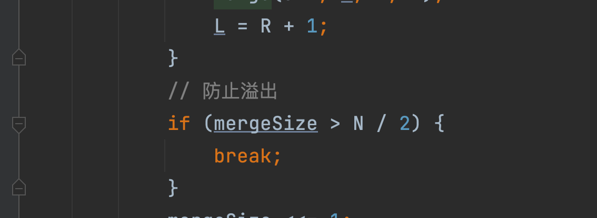

## 重点
0. 所有的基于比较的排序方法都可以理解为对每个元素进行了比较。但是通过算法设计，N*logN的算法规避了一部分不必要的比较，减少了计算量
1. 归并排序本身是通过 左区间 右区间排好序后 进行头指针比较，避免了所有数字的两两比较，实现的计算量缩减。(暴力N^2 -> N*logN)
  - 【超重点】对于归并排序而言，它在减少计算量的同时，允许你计算每一个元素 大于或小于它的 左右侧元素数量。
    - 其实快排-荷兰国旗也能做个数统计，但是归并适用面积更大，同时覆盖 大于右侧两倍 和 区间和这种 超出简单积累个数的问题。
2. 双向链表排序问题，每一步都要**步步惊心**！！！ 一定要注意：
  1. 每次链接 涉及到 next 和 last指针的链接
  2. 每次断连，也是涉及到两个节点 next 和 last指针
  3. 重新整合/重排序，特别注意清理last next 防环。 例如快排，涉及到三向分区 分割和整合。  分割时三个分区都要注意清理head, tail的前后指针。 整合时注意 链接的两个指针调节 以及 连接后的 首尾指针的next last清理


## 大纲
1. O(N^2) 排序：冒泡，选择，插入
2. O(NlogN):归并，随机快排，堆排
3. O(N): 非基于比较的排序（桶排）：计数排序，基数排序
4. 扩展：希尔排序
5. 链表排序问题也需要关注：
   - 双向列表的快排
   - 链表的插排


## 错题本
1. [insertionSort](BasicSort.java): 注意插排区间的退出条件break不要漏掉
2. [mergeSort非递归](MergeSort.java): 存在可能性：int类型 b = a/2, b * 2 < a
- **涉及到整型/2**。防溢出部分的代码，需要清晰的分类讨论>, <, =的情景，特别是=
  - 特别对于=的情况，step = len/2时，也需要 step * 2。因为此时有可能 step * 2 < len
  - ```java
    int b = a / 2;
    b * 2 < a; 
    ```
  - int / 2是向下取整。所以说 /2之后的值 是 【小于等于】 真实的 除以2之后的数字值的。这就导致 *2之后其实是<=原值的，尤其是可能会【小于】
  - 这就导致 a/2 * 2 < a 。 这是一个陷阱(aka. b = a/2, b * 2 < a)。重要例子 2 和 5(5/2=2)
  - 但是如果 b > a / 2，那么 b * 2 > a是必然的 （5和3的例子）
- 在代码层面，优化后的思路应该是：**分层处理，各司其职！（学学人家TCP协议栈）**
  - 外层while做判断，里面的if防溢出（只有*2>len才考虑防溢出break；只要不溢出*2<=len，就要正常*2 交由while处理）。 不要让里面的if也帮忙做判断(错就错在处理=的时候，判断了*2不溢出但是直接放到了break条件里，没有正常*2走while) 
  - 一切的判断都交由外层的while。
  - break的条件只有当完全大于len时。 （也就是说，即便是=len，也意味着 *2不溢出，那么此时应该*2 交由外层while来处理）
  -  而且，本着「分层思想，各司其职」的代码编写风格。防溢出的代码应该只break 可能溢出部分，对于所有不溢出的情况，都应该放行，正常 *2 走while循环！！！ （不要僭越，想不明白的时候容易出问题）
- 左神写的就很好，直接：
- (l + r) / 2 如果 [l,r]数量为偶数，那么返回**上中位数**