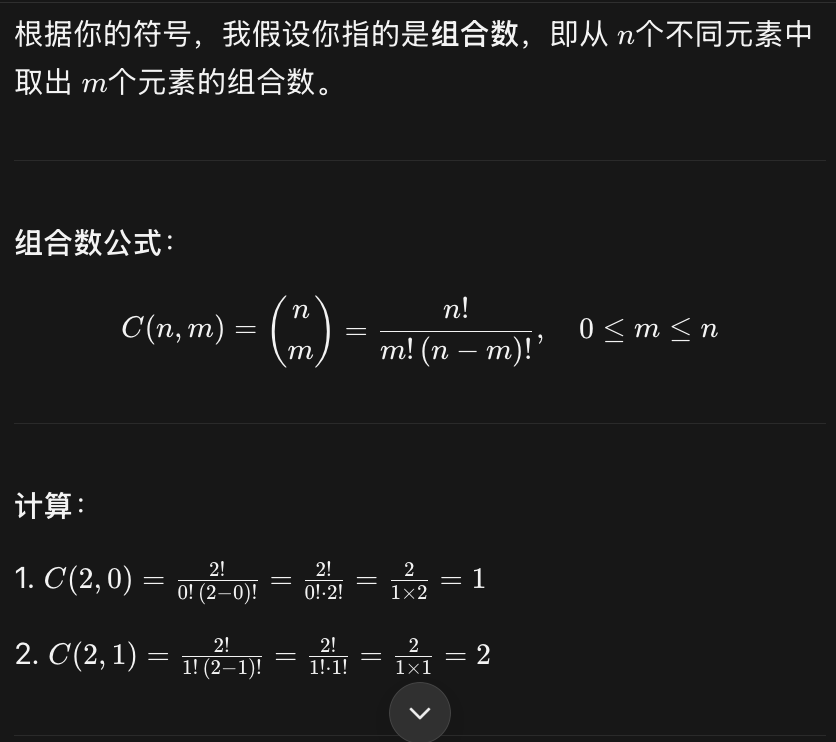
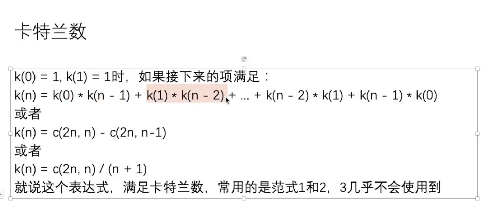

排列数通常用符号 A(n,m)表示，而组合数用 C(n,m)表示。

### 卡特兰数： 包含延伸题型
- https://baike.baidu.com/item/%E5%8D%A1%E7%89%B9%E5%85%B0%E6%95%B0/6125746?fr=aladdin
```
(1) 普遍公式： 记清楚 -> 总共 n 项， 每一个相乘的pair 加起来是 n - 1
k(n) = k(0) * k(n - 1) + k(1) * k(n - 2) + ... + k(n - 2) * k(1) + k(n - 1) * k(0);
- 可以把k()换成f()，就是一个函数的推导式，
- 对应 这个模型：【不容易】一共有n个无差别节点，有多少种组成二叉树的方式。 节点无差别的意思就是 只有结构不同才算不同的二叉树

(2) 不常用 -> 但是 编程时 使用该公式 -> 得到 结果
k(n) = C(2n, n) / (n + 1)

(3) 最常使用 -> 匹配的括号组合数量 模型
k(n) = c(2n, n) - c(2n, n - 1)


额外：
求 最大公约数 -> 辗转相除法 (必须用这个方法，使用取模或者循环体内除法都不行)

int gcd(int m, int n) {
  return n == 0 ? m : gcd(n, m % n);
}
```
- [卡特兰数][CatalanNumber.java](CatalanNumber.java):
    -  纯功能函数， 记牢，使用BigInteger计算 C(2n, n)。  因为组合数值很大！！！

## 知识讲解
1. 最重要的模型是是 [左右括号匹配问题]  C(2n,n) - C(2n,n-1)
2. 还有一个模型，二叉树模型，对应公式 k(0) * k(n - 1) + k(1) * k(n - 2) + ... + k(n - 2) * k(1) + k(n - 1) * k(0);
  - 这类敏感性【不容易】，题意为一共有n个无差别节点，有多少种组成二叉树的方式。 节点无差别的意思就是 只有结构不同才算不同的二叉树

## 实现
- 实现上使用元宝教的方法，全部转成BigInteger就行了。 注意所有的数字，BigInteger.valueOf(1),  BigInteger#multiply / divide 这类方法

  - 具体解释：
    - 对于二叉树模型，n个节点 -> C(2n, n) / (n + 1)
    - 对于括号模型，左括号n个，总括号2n个 -> C(2n, n) / (n + 1)